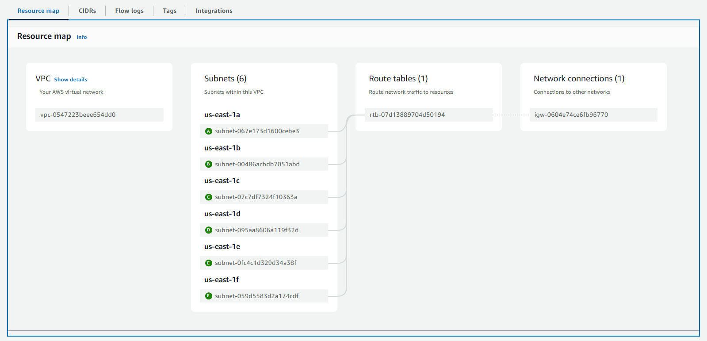

# Task 2: Basic Infrastructure Configuration #

## Object ##

In this task, you will write Terraform code to configure the basic networking infrastructure required for a Kubernetes (K8s) cluster.

## Components ##

### VPC ###

- **CIDR Block:** 10.0.0.0/16

### Subnets ###

- **Public Subnets:**
  - `10.0.1.0/24` (us-east-1a)
  - `10.0.2.0/24` (us-east-1b)
  
- **Private Subnets:**
  - `10.0.3.0/24` (us-east-1a)
  - `10.0.4.0/24` (us-east-1b)

### Bastion Host ###

- **Type:** `t2.micro`
- **Security Group:** SSH access only from your IP.

### NAT Solution ###

- **NAT Gateway** (or NAT Instance if configured): Allows instances in private subnets to access the internet while remaining inaccessible from the outside.

## Verify configurations ##


## Security Groups ##

- **bastion_sg:** Allows SSH access from your public IP.
- **private_instance_sg:** Allows all internal traffic.

## How to Use ##

1. **Install Terraform:** Make sure you have Terraform installed.
2. **Configure AWS Credentials:** Set your AWS credentials in your environment.
3. **Initialize Terraform:** Run `terraform init` to initialize the directory.
4. **Validate Configuration:** Run `terraform validate` to ensure the configuration is valid.
5. **Apply Configuration:** Run `terraform apply` to provision the infrastructure.

## Cleanup ##

To destroy the infrastructure, run:

```bash
terraform destroy
