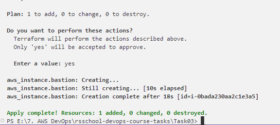
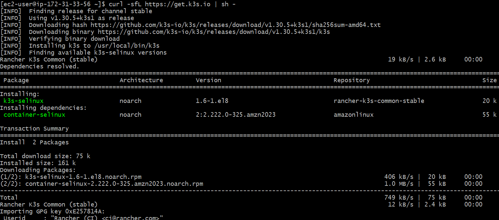
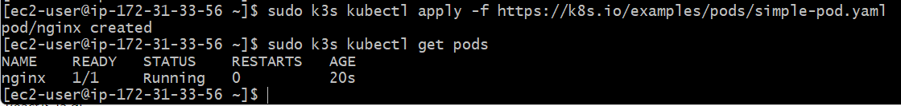
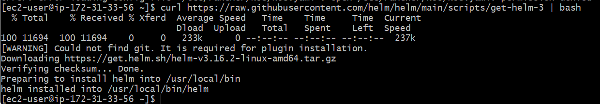
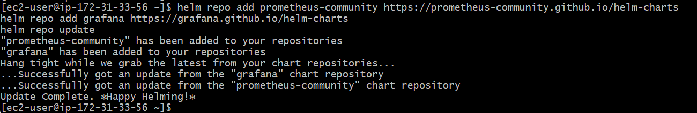

# Step By Step to Config K8s Cluster #

    1. Create S3 bucket for store kOps state
    2. Create main.tf for manage AWS resource
    3. Init and apply Terraform
    4. Install k3s
    5. Cluster Deployment

## Evaluation Criteria (100 points for covering all criteria) ##

### 1. Terraform Code for AWS Resources (10 points) ###

### 2. Cluster Deployment (60 points) ###

### 3. Cluster Verification (10 points) ###

### 4. Workload Deployment (10 points) ###

### 5. Additional Tasks (10 points) ###

- Document the cluster setup and deployment process in a README file.

- Helm install
  

- Add the Prometheus and Grafana Helm charts
  
