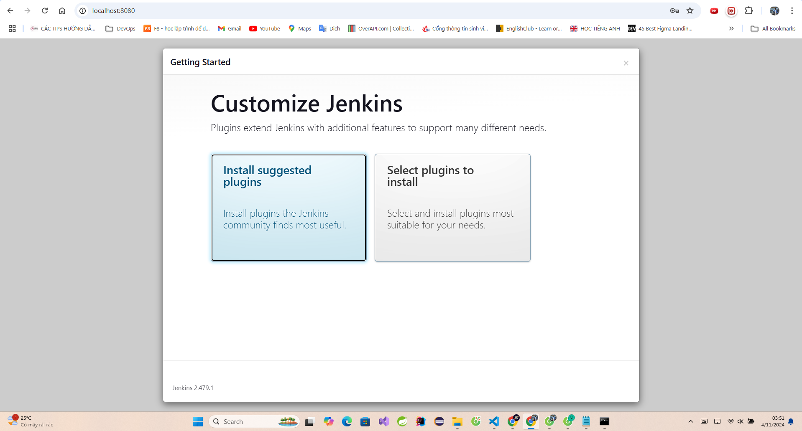
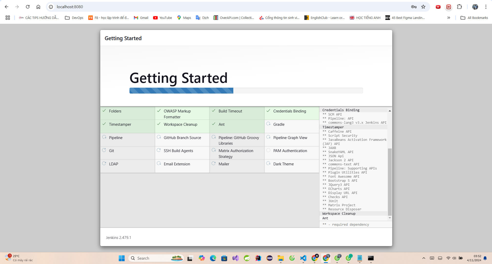
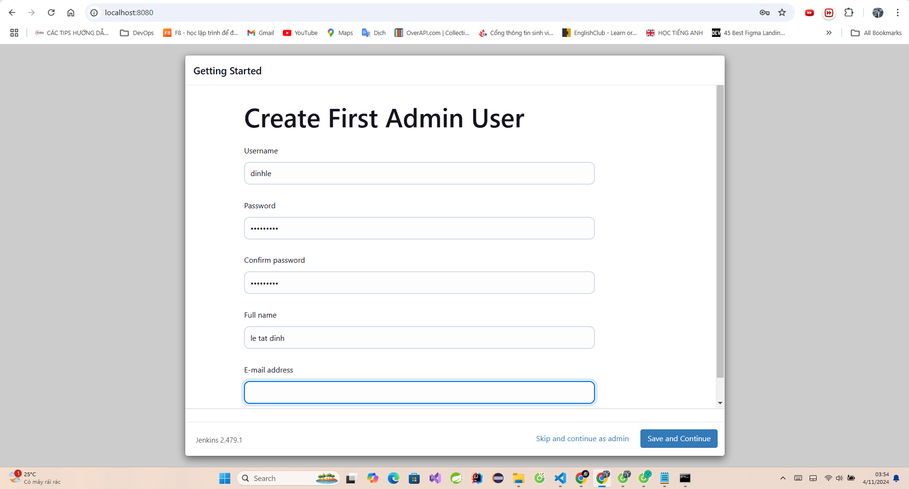
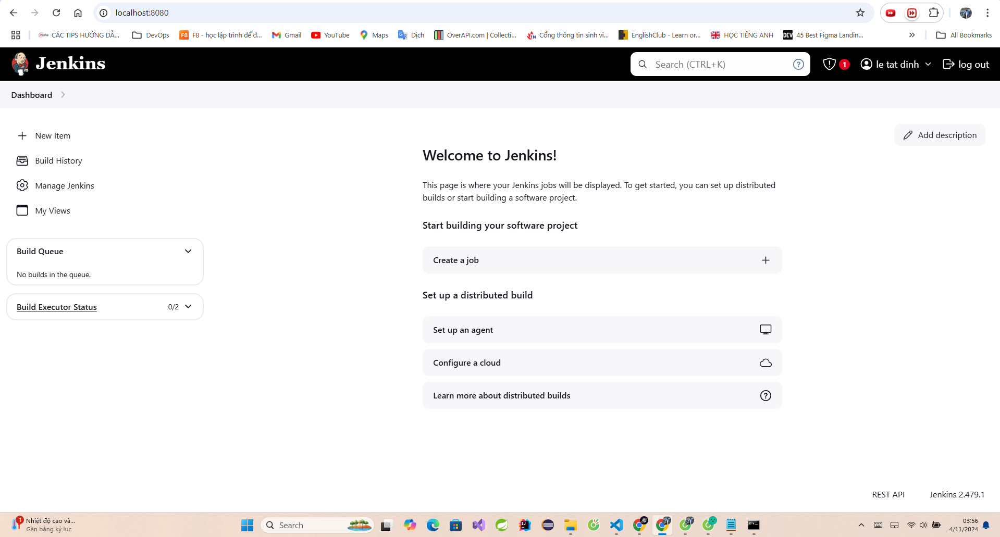

[Task 4](https://github.com/dinh-le2701/rsschool-devops-course-tasks/tree/feature/task4-jenkins)

Evaluation Criteria (100 points for covering all criteria)
 
1. Helm Installation and Verification (10/10 points)
   * [x]  Helm is installed and verified by deploying the Nginx chart.

2. Cluster Requirements (10/10 points)
   * [x]  The cluster has a solution for managing persistent volumes (PV) and persistent volume claims (PVC).

3. Jenkins Installation (50/50 points)
   * [x]  Jenkins is installed using Helm in a separate namespace.
   * [x]  Jenkins is available from the internet.

4. Jenkins Configuration (10/10 points)
 
   * [x]  Jenkins configuration is stored on a persistent volume and is not lost when Jenkins' pod is terminated.

5. Verification (10/10 points)
 
   * [x]  A simple Jenkins freestyle project is created and runs successfully, writing "Hello world" into the log.

6. Additional Tasks (5/10 points)
GitHub Actions (GHA) Pipeline (5 points)

   * [ ]  A GHA pipeline is set up to deploy Jenkins.
Authentication and Security (5 points)
   * [x]  Authentication and security settings are configured for Jenkins.

> Total: 95/100

